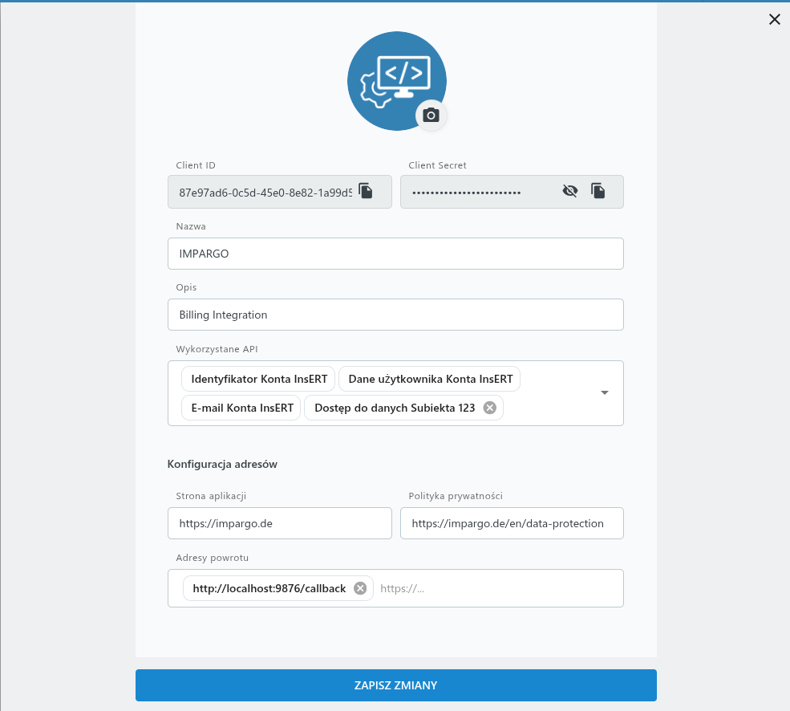
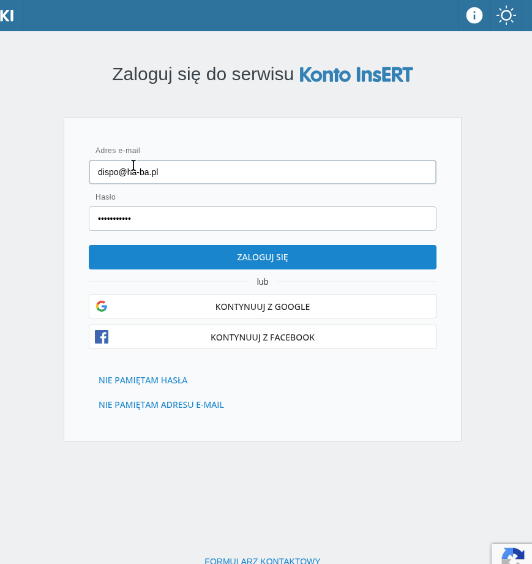

# insERT / Subiekt123 CLI

Simple TypeScript example for the full insERT OAuth flow and a first Subiekt123 API smoke test.

---

## Developer Setup

### Prerequisites

- Node.js 18+
- yarn

### Install

```bash
yarn install
```

### Quick start

Set environment variables:

```bash
export CLIENT_ID="your-client-id"
export CLIENT_SECRET="your-client-secret"
export SUBSCRIPTION_KEY="your-subscription-key"
```

The non-secret defaults are hard-coded at the top of [src/cli.ts](src/cli.ts).

Run the full flow:

```bash
yarn dev
```

### What it does

- Generates PKCE
- Opens the login page
- Waits for the local callback
- Exchanges the code for a token
- Saves the token to `.insert-token.json`
- Calls the documents endpoint and prints the JSON

### Security notes

- `.env` and `.insert-token.json` are ignored by git
- secrets should stay in environment variables

---

## Task / Problem Description

### Objective

Fix the OAuth setup and/or the CLI tool so that the entire flow runs successfully **once**, from start to finish:

```bash
yarn dev
```

Should complete without errors and return:
1. A valid access token saved to `.insert-token.json`
2. A successful API response with the documents list printed as JSON

### The Issue

When a user follows the authorization link, logs in, and clicks "authorize", an internal server error occurs instead of redirecting back to the local callback endpoint with an authorization code.

### Application Setup

The application is configured with:
- OAuth app client ID and secret
- Callback URL set to `https://localhost:9876/callback`
- All required scopes

See **Screenshot 1** for the OAuth application configuration:



### Error Observed

After successful login and authorization consent, the browser shows an internal server error instead of redirecting to the callback endpoint.

See **Screenshot 2** for the error that occurs:



### What Should Happen

1. User clicks the authorization link printed by the CLI
2. Browser opens the identity server login page
3. User logs in and grants consent
4. Browser redirects to `https://localhost:9876/callback?code=<auth_code>&state=<state>`
5. The local callback server captures the code
6. The CLI exchanges the code for a token
7. The CLI calls the documents API and prints the result


